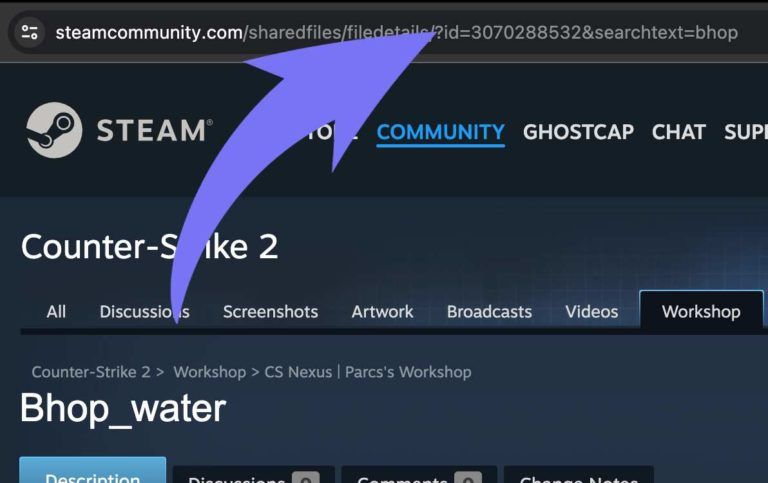

import { Steps } from '@astrojs/starlight/components';

:::danger
This only works for Steam players, [Ark Survival Evolved servers](https://www.gamehostbros.com/ark-survival-evolved-server-hosting/) have NO Mod support for Epic Games players.
:::

## How To Get Your Workshop Mod IDs

You will need to know how to get a Workshop ID for each mod you want to install. You can [view all the ARK Survival Evolved mods here](https://steamcommunity.com/workshop/browse/?appid=346110&requiredtags%5B%5D=Mod)

Once you find the mod you want you need to copy the URL. Let's use this URL for example: [https://steamcommunity.com/sharedfiles/filedetails/?id=3070288532&searchtext=bhop](https://steamcommunity.com/sharedfiles/filedetails/?id=3070288532&searchtext=bhop)

Go to the Steam Workshop page for Ark Surival Evolved, which can be found [here](https://steamcommunity.com/workshop/browse/?appid=346110&requiredtags%5B%5D=Mod)

## How to Install Mods on Your Ark Survival Evolved Server.
<Steps>
1. Log in to the [Game Host Bros Panel](https://panel.gamehostbros.com/) and stop your ARK server.
2. Go to `Configuration > Startup Parameters`.
3. Select `Mods`.
4. Paste the Workshop ID into `Mods`. ex: `821530042`.
5. Start your server.
</Steps>
:::tip
For multiple mods you have to seperate each Mod ID with `,` for example: `821530042,731604991`
:::
