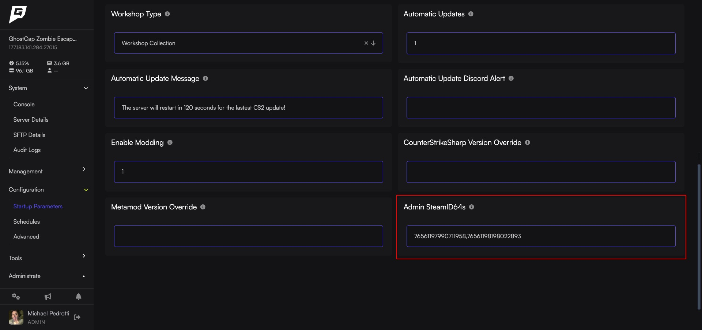

import { Steps } from '@astrojs/starlight/components';

One of the biggest struggles we've seen with new [CS2 server](https://www.gamehostbros.com/cs2-server-hosting/) owners is setting up admin permissions on their new server. At Game Host Bros, we've made it so our panel will take care of creating all the admin and group files that are needed.

## Automatically Setting Up Admins

This is the fastest way of setting up admins in CS2. This will set all the player flags to `@css/root` and add them to the `#css/admin` group. In most cases this means they will have access to everything.
<Steps>
1. Make sure [Enable Modding](/games/counter-strike-2/install-plugins/) is turned on.
2. Get the link to your Steam profile, and input it into https://steamid.io/ 
3. Copy your `steamID64` ID.
4. Access the [Game Host Bros Panel](https://panel.gamehostbros.com/) and click on your CS2 server.
5. In the sidebar click on `Configuration > Startup Parameters`.
6. Look for `Admin SteamID64s` and paste your ID there.
7. Restart your server.
</Steps>
You can add multiple admins by adding a comma between each SteamID64 like this `76561197990711958,76561198034202275`

:::note
You cannot manually edit `admins.json` using this method. You can add custom flags to `admin_groups.json` if needed for specific plugins. Please see the Advance Settings below if you need to setup custom permissions.
:::

Now you can [install an admin management plugin](/games/counter-strike-2/install-plugins/) such as CS2 Simple Admin straight from our Mod Manager, and it will work out of the box.

## Advance Settings

If you would rather manually edit your `admins.json` and `admin_groups.json` for multiple groups or fine control over admins, you will need to leave `Admin SteamID64s` blank. Doing this means our Game Panel will no longer edit these files at all (other than renaming `admin_groups.example.json` to `admin_groups.json` once).

**Editing admins.json**: https://docs.cssharp.dev/docs/admin-framework/defining-admins.html
**Editing admin_groups.json:**: https://docs.cssharp.dev/docs/admin-framework/defining-admin-groups.html