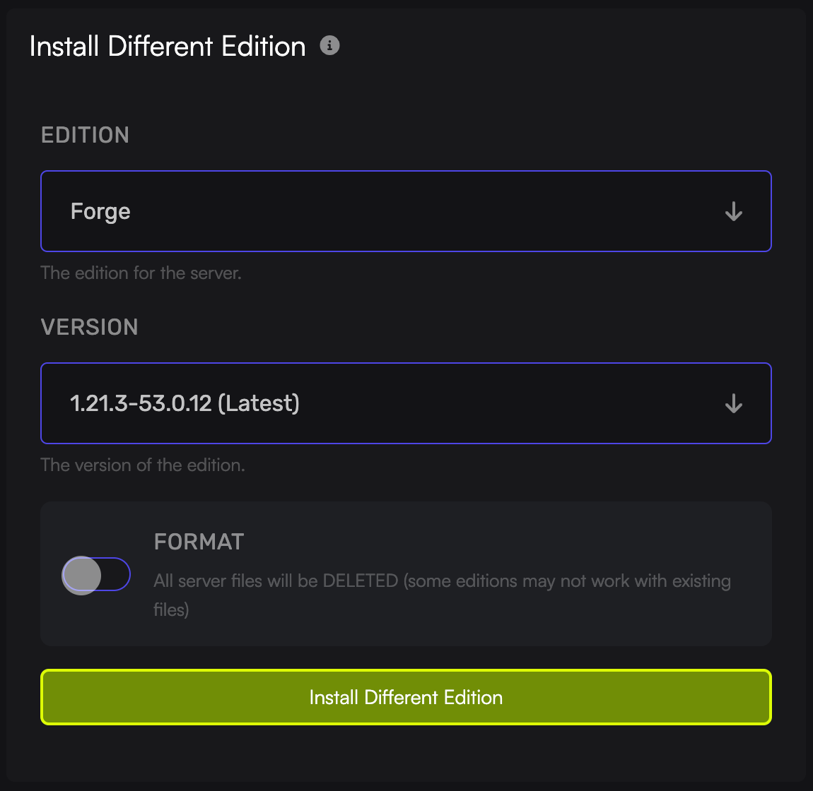

import { Steps } from '@astrojs/starlight/components';

Many mods and plugins are only compatible with certain Minecraft versions, in order to run older game versions and plugins you'll have to change the version of your Minecraft server. This is what you do if you need to change your [Minecraft server](https://www.gamehostbros.com/minecraft-server-hosting/) version.

Here is a list of the different versions you can install in our panel:
- [Bungeecord](https://www.spigotmc.org/go/bungeecord)
- [CraftBukkit](https://getbukkit.org/download/craftbukkit)
- [Fabric](https://fabricmc.net/)
- [Forge](https://forums.minecraftforge.net/)
- [Neoforge](https://neoforged.net/)
- [Paper](https://papermc.io/)
- [Purpur](https://purpurmc.org/)
- [Quilt](https://quiltmc.org/en/)
- [Spigot](https://www.spigotmc.org/)
- [SpongeVanilla](https://spongepowered.org/)
- [Vanilla](https://www.minecraft.net/en-us)
- [Velocity](https://papermc.io/software/velocity)
- [Waterfall](https://papermc.io/downloads/waterfall)

## Changing Minecraft Server Version

<Steps>
  1. Log in to the [Game Host Bros Panel](https://panel.gamehostbros.com/) and select your Minecraft server.
  2. Go to `Configuration > Advanced`.
  3. Select the new edition and version you want under `Install Different Edition`.
  4. Enable `Format` (This will delete all your existing files) and click `Install Different Edition`.
  5. Go back to the Console and start your server.
</Steps>
:::danger
Format will delete all of your files to make sure the version changes successfully. Create a backup if you have anything you want to keep!
:::

If you get stuck at any time, you can reach out to us on [Discord](https://discord.gg/FN4XgbAwzr).
