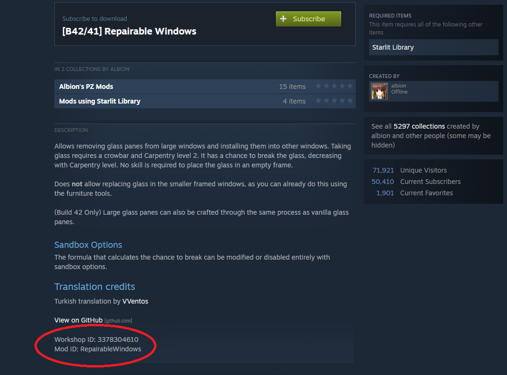

import { Steps } from '@astrojs/starlight/components';

If you're looking to further customize your server outside of basic gameplay settings, modding is a fantastic way to do so. Here's how to install mods on your [Project Zomboid Server](https://www.gamehostbros.com/project-zomboid-server-hosting/).


## Getting Mod And Steam Workshop IDs

You will need to know how to get a Workshop ID and Mod ID for each mod you want to install. You can [view all the Project Zomboid mods here](https://steamcommunity.com/app/108600/workshop/)

Once you find the mod you want you need to note the following, let's use this Mod for example: [https://steamcommunity.com/sharedfiles/filedetails/?id=3378304610](https://steamcommunity.com/sharedfiles/filedetails/?id=3378304610)



As you can see from the details at the bottom of the Steam Workshop page, this Mods Workshop ID is `3378304610` with it's Mod ID being `RepairableWindows`.

## Installing Mods

<Steps>
1. Access the [Game Host Bros Game Panel](https://panel.gamehostbros.com/) and stop your server.
2. In the sidebar go to `Management > File Manager`.
3. Navigate to and open `.cache/Server/pzserver.ini`.
4. Add the Workshop ID to `WorkshopItems`.
5. Add the Mod ID to `Mods`.
6. Once finished, click save and start your server.
</Steps>

Here's an example using these mods [RepairableWindows](https://steamcommunity.com/sharedfiles/filedetails/?id=3378304610) and [Water Goes Bad](https://steamcommunity.com/sharedfiles/filedetails/?id=2849467715).

``` 
WorkshopItems=3378304610;2849467715
```
```
Mods=RepairableWindows;WaterGoesBad
```

:::tip
To install multiple mods you must separate each Mod Workshop ID and Mod ID listing with a semicolon, for example `RepairableWindows;WaterGoesBad` as seen above.
:::