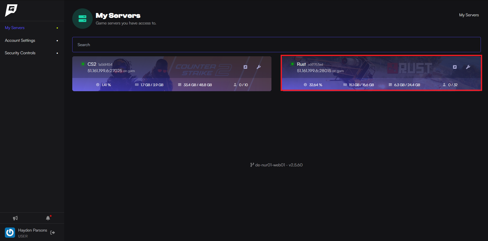

import { Steps } from '@astrojs/starlight/components';

Here is how to add admins to your [Rust server](https://www.gamehostbros.com/rust-server-hosting/).

Before beginning this guide, you should have the SteamID64 of the user you want to add as an admin/moderator.

## Setting Yourself As An Admin In Rust

<Steps>
1. Log into the [Game Host Bros Panel](https://panel.gamehostbros.com) and select your Rust server.

2. Enter the following command into the console, using the SteamID64 previously obtained:
`moderatorid <STEAMID64> <NAME (or) REASON>`
3. Save the configuration by typing `writecfg` into the console.
4. Restart the server, and the user should now be an admin.
</Steps>