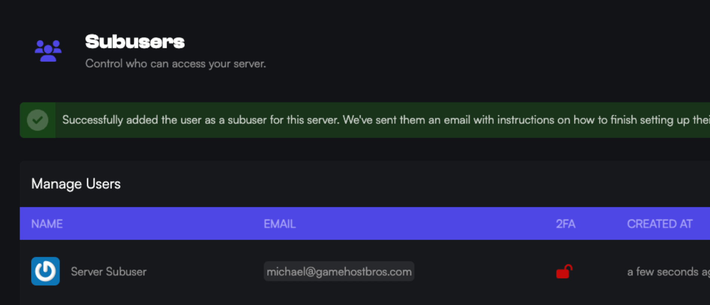

import { Steps } from '@astrojs/starlight/components';

With Game Host Bros you can add different Subusers to help with your server. Each user you add can have their own permissions from something basic such as restarting the server, all the way up to full admin access.

<Steps>
1. Load the [Game Host Bros Panel](https://panel.gamehostbros.com/) and select your server.
2. In the left-hand menu, click `Management > Subusers`.
3. Click the button labeled `Create`.
4. Input the User’s email address and assign the permissions you want to give them.
5. Click `Add New Subuser` to save.
</Steps>

After a Subuser is added, they will then be sent an email with further instructions on setting up their account.