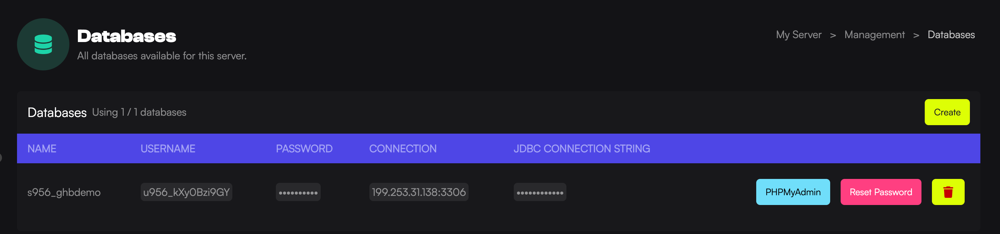

import { Steps } from '@astrojs/starlight/components';

Setting up a MySQL database is a crucial step for running many game server plugins that require data storage. In this guide, you'll learn how to effortlessly create and manage databases through the Game Host Bros panel.

## Creating A Database

<Steps>
1. Load the [Game Host Bros Panel](https://panel.gamehostbros.com/) and select your server.
2. In the left-hand menu, click `Management > Databases`.
3. Click the `Create` button.
4. Fill out the following details:
   - **Host:** Select a host that is closes to your game server.
   - **Name:** The name for the database itself.
   - **Connections From:** Leave this as `%` unless you want to whitelist your server IP address.
</Steps>
Now you can locate the plugin you'd like to use the MySQL database for. Open the plugin's configuration file and input the database details correctly. You will need to refer to the documentation of the plugin for the specific location.

:::note
- Deleting your database will remove all the information in that database instantly.
- Backups do not include databases, and we cannot restore a deleted database.
- The MySQL port is always, 3306.
:::

## Reset A Database Password
Sometimes you may need to reset a database password for whatever reason. This is how you can do it.
<Steps>
1. Load the [Game Host Bros Panel](https://panel.gamehostbros.com/) and select your server.
2. In the left-hand menu, click `Management > Databases`.
3. Click the `Reset Password` button.
</Steps>
Make sure you update any plugin configuration that uses that password.

## Using the JDBC Connection String
Some Java plugins require a JDBC connection string to connect to your MySQL database. We provide you with a string to use that contains all the necessary details required to establish a connection between your application and the database.
<Steps>
1. Load the [Game Host Bros Panel](https://panel.gamehostbros.com/) and select your server.
2. In the left-hand menu, click `Management > Databases`.
3. Find the database you created, and you’ll see the **JDBC Connection String**.
</Steps>
